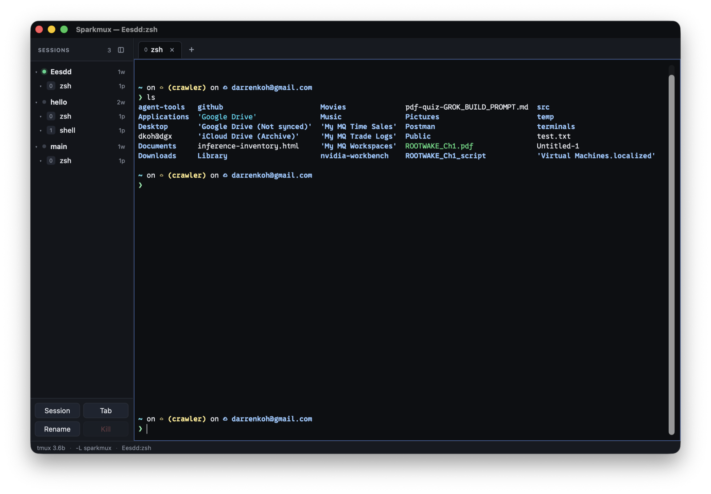

# sparkmux

A desktop app that **launches and owns** a private tmux server, then shows **tiled real terminals** — one xterm.js view per pane — laid out from tmux itself.

Works on Apple Silicon macOS and NVIDIA DGX Spark (ARM64 Ubuntu 24.04). Requires **tmux 3.2+**.

Your default tmux server is never touched. sparkmux uses `-L sparkmux`.



## Install

One script installs tmux (if needed) and the desktop app. Apple Silicon or ARM64 Linux:

```bash
curl -fsSL https://raw.githubusercontent.com/darrenkoh/sparkmux/main/scripts/install.sh | bash
```

If there is no GitHub Release yet, the script builds from source (needs Rust, Node.js, and on Linux the WebKitGTK headers). From a clone:

```bash
./scripts/install.sh --from-source
```

### macOS (Apple Silicon)

1. `brew install tmux` if you do not already have tmux 3.2+.
2. Run the installer, or download the `.dmg` from [Releases](https://github.com/darrenkoh/sparkmux/releases).
3. Builds are **unsigned**. First open: right-click Sparkmux.app → **Open**.
4. Double-click Sparkmux. Create a session in the sidebar.

### Linux (ARM64 / DGX Spark)

1. `sudo apt install tmux`
2. Run the installer, or install the `.deb` from [Releases](https://github.com/darrenkoh/sparkmux/releases).
3. Launch `sparkmux-desktop`. User-prefix installs land in `~/.local/bin`.

### After install

- Quit the app **detaches**; the tmux server keeps running. Reopen to reconnect.
- Attach from any terminal: `tmux -L sparkmux attach`
- Optional: a nerd font such as [0xProto](https://github.com/ryanoasis/nerd-fonts) improves glyph rendering.

### Developers

```bash
git clone https://github.com/darrenkoh/sparkmux.git
cd sparkmux
cd apps/desktop && npm install && npm run tauri dev
```

`cargo tauri` is **not** a built-in Cargo command — use `npm run tauri`.

If linking fails with “You have not agreed to the Xcode license”, either run `sudo xcodebuild -license` or point cargo at the Command Line Tools compiler (no sudo):

```bash
export DEVELOPER_DIR=/Library/Developer/CommandLineTools
```

The repo `.cargo/config.toml` already sets `DEVELOPER_DIR` / `SDKROOT` for Command Line Tools.

CLI (optional):

```bash
cargo install --path crates/sparkmux
sparkmux doctor
```

Release CLI binary is `target/release/sparkmux`. The desktop crate is `sparkmux-desktop` (`Sparkmux.app` / Linux `sparkmux-desktop`).

Tagged `v*` pushes build macOS `.dmg` / `.app` and Linux `.deb` via GitHub Actions.

## CLI

```bash
sparkmux                 # usage (exit 2) — the TUI is gone
sparkmux dump            # session tree JSON on -L sparkmux (starts default session if empty)
sparkmux version         # sparkmux + detected tmux
sparkmux doctor          # binary, socket path, sessions
sparkmux --system dump   # user's default tmux server
sparkmux -L other dump
```

Flag > env (`SPARKMUX_TMUX`) > config file > default.

## Desktop

- Sidebar: sessions / windows / panes of `-L sparkmux` only. Drag the sash to resize; the header icon or hover chevron hides it. A pip marks hidden windows with bell or activity.
- Main: tiled xterm.js matching `window_layout`. Typing goes to the focused pane.
- File → New Session… creates that name only (does not also create `main`).
- File → New Tab (⌘T) adds a window in the attached session.
- Paste with ⌘V (macOS) or Ctrl+Shift+V (Linux).
- tmux → Stop tmux server… asks for confirm, then `kill-server`.
- Quit detaches; the tmux server keeps running. Reopen the app to reconnect.

Missing tmux: in-window setup with a copyable `brew` / `apt` command.

## Config

- Linux: `~/.config/sparkmux/config.toml`
- macOS: `~/Library/Application Support/sparkmux/config.toml`

```toml
tmux_bin = ""
socket_name = "sparkmux"
refresh_ms = 1000
default_session = "main"
```

## v0 non-goals

Notarized Mac builds, Homebrew cask, Windows/x86, listing the default tmux server in the GUI, Ratatui TUI, Electron, bundled tmux, prefix-key emulation, SSH fleet manager.

## License

MIT. Copyright (c) 2026 Darren Koh.
