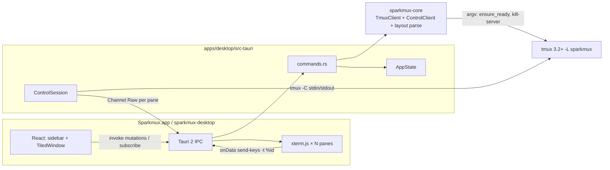
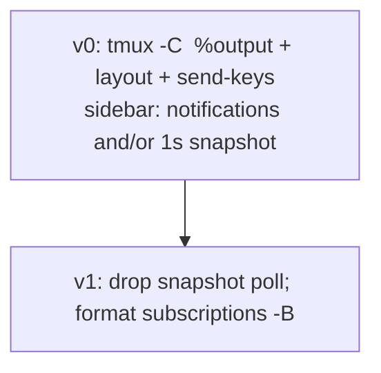
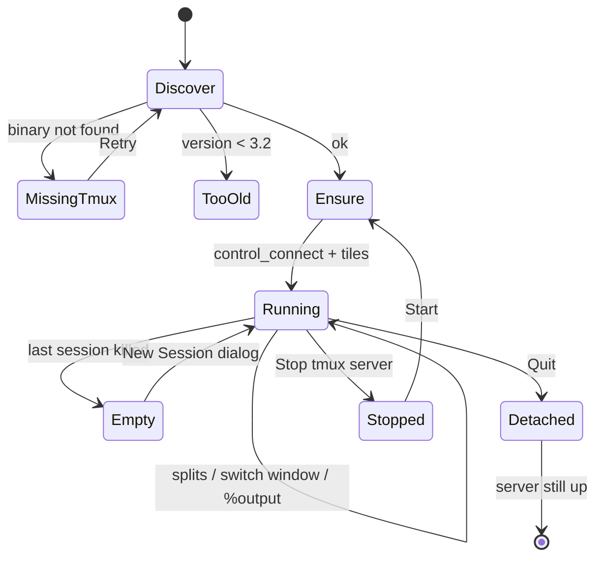

# sparkmux Desktop App — Design Document

| Field | Value |
|---|---|
| **Title** | sparkmux Desktop: own a tmux server from a native window |
| **Author** | Darren Koh |
| **Date** | 2026-09-17 |
| **Status** | Draft |
| **Repo** | https://github.com/darrenkoh/sparkmux |
| **Supersedes** | v0 Ratatui TUI spec (`SPARKMUX_BUILD_PLAN.md`) |

This is a total product change. The v0 TUI *browsed* an already-running tmux server via `list-*` / `capture-pane`. The desktop app *launches and owns* a dedicated tmux server and puts **real per-pane terminals** in a native window, tiled to match tmux's layout.

---

## Overview

sparkmux v0 is a Ratatui dashboard (`crates/sparkmux`) that shells out through `sparkmux-core::TmuxClient` to inspect the user's **default** tmux server. It never starts tmux. If the server is down it shows an empty state. The "live preview" is `capture-pane -p -e` polled at 400 ms — a screenshot of a pane, not a terminal. Attach `exec`s `tmux attach-session` and the TUI process goes away.

That is the wrong product. The user wants a **desktop application** they double-click / `open`. On launch the app finds tmux, starts a **private** server if needed, creates a default session, and the user works in **real terminals** inside the window. tmux remains the multiplexer (persistence, splits, later attach from iTerm/ssh). sparkmux is the front-end that owns that server.

v0 desktop ships a Tauri 2 window: session/window/pane sidebar plus a **tiled grid of xterm.js instances**, one per pane of the selected **window**, laid out from tmux `window_layout`. A pane already owns a PTY; the GUI does **not** attach a second master PTY. Output and keys go through **tmux control mode** (`tmux -C`): `%output` into each xterm, `send-keys -t %id` out. Quit detaches the control client; the server keeps running. **Stop tmux server** is nested under the tmux menu with a confirm that names the socket and session count.

---

## Background & Motivation

### Current state

Workspace (Rust 2021, MIT, targets `aarch64-apple-darwin` and `aarch64-unknown-linux-gnu`):

```
crates/sparkmux-core   tmux I/O (argv Command, no control mode, no PTY)
crates/sparkmux        clap CLI + Ratatui TUI
```

All tmux I/O already goes through `TmuxClient` in [`crates/sparkmux-core/src/client.rs`](../crates/sparkmux-core/src/client.rs):

- Discover binary (`discover_bin`): explicit path, else `$PATH` lookup of `tmux`, else `/opt/homebrew/bin/tmux`, `/usr/local/bin/tmux`, `/usr/bin/tmux`. Core does **not** read `SPARKMUX_TMUX`; that env is a clap `#[arg(env = "SPARKMUX_TMUX")]` on the CLI only today.
- Socket: CLI `-L` / `-S` if passed into `TmuxClient::new`. No env equivalent for socket. Otherwise the **default** server (`socket_name: None`, `socket_path: None`).
- Snapshot: `list-sessions` / `list-windows -a` / `list-panes -a` with `\x1f` formats, parsed in [`snapshot.rs`](../crates/sparkmux-core/src/snapshot.rs). `list-sessions` with no sessions is a non-zero exit; `is_server_down` matches `"no server" | "error connecting" | "no such file"` only — **not** `"no sessions"`.
- Preview: `capture-pane -p -e -t %id` with a 300 ms timeout ([`preview.rs`](../crates/sparkmux-core/src/preview.rs), worker in [`app.rs`](../crates/sparkmux/src/app.rs))
- Mutations: `new-session -d`, rename/kill session/window/pane, `switch-client` / `select-window` / `select-pane`
- Attach: `decide_attach(inside, cursor)` then either `exec attach-session` or switch-and-quit
- Version: `tmux -V`, require ≥ 3.2 ([`version.rs`](../crates/sparkmux-core/src/version.rs))
- Empty/error: `Error::TmuxNotFound` / `Error::ServerDown` — TUI still starts

Config lives in the binary crate ([`crates/sparkmux/src/config.rs`](../crates/sparkmux/src/config.rs)). `load(&Cli)` applies file then clap flags. Defaults: `refresh_ms = 1000`, `preview_ms = 400`, `socket_name: None` (empty TOML key is ignored → default server). Precedence is **not** a uniform flag > env > file: only `tmux_bin` has an env (`SPARKMUX_TMUX` via clap); `-L`/`-S` are flags only.

`Session.attached` is `#{session_attached}` (any client on that session). The desktop must not use it as “our control client is here”; that is `GuiState.attachedSession`.

`Window.layout` is already parsed from `#{window_layout}` — the desktop will parse that string into a tile tree instead of ignoring it.

### Pain points (why the TUI is not the product)

1. **The user must already have tmux running.** The TUI is a browser, not a workspace. First-run is an empty state that says "start tmux".
2. **`capture-pane` is not a terminal.** No keyboard, no nvim, no live splits as first-class views.
3. **Attach abandons the app.** Enter `exec`s tmux; sparkmux is gone. The GUI is not a place to *work*.
4. **Default socket collides with the user's life.** Listing `$0 work` from the default server is a nice debugger; it is not an app with a private session tree.
5. **A TUI cannot be the primary surface** if the user asked for a desktop window they double-click.

### What we keep

tmux. The snapshot parser (including `window_layout`). Binary discovery. Version gate. Mutation helpers. MIT license. The same GitHub repo. The same two ARM targets. The rule that **all tmux I/O goes through `sparkmux-core`** (argv *and* the control-mode session).

---

## Goals & Non-Goals

### v0 desktop goals

- Native windowed GUI (Tauri 2 + React + TypeScript + Vite). Double-click / `open` / `.desktop` launcher.
- On launch: locate tmux → start dedicated server `-L sparkmux` if missing → `new-session -d -s <config.default_session>` (`"main"` unless overridden) `-c $HOME` if the tree is empty → open a **control-mode** client on that session.
- Window layout: sidebar (sessions / windows / panes of **only** `-L sparkmux`) + main area = **tiled xterm.js, one per pane of the selected window**, geometry from tmux `window_layout`.
- Selecting a **window** retile to that window's panes. Selecting a **pane** focuses that xterm (`select-pane` + JS focus).
- Create / rename / kill session and window from the GUI.
- Split Right / Split Down; layout follows tmux (do not invent a second multiplexer).
- Quit app: **detach** the control client only. tmux server keeps running. Next launch reconnects.
- **Stop tmux server** nested under the tmux menu, confirm that names socket + session count.
- Missing tmux binary: in-window error with install hint (`brew install tmux` / `sudo apt install tmux`). Do not panic.
- tmux < 3.2: block with upgrade hint (control mode + mutations need ≥ 3.2).
- Targets: `aarch64-apple-darwin` and `aarch64-unknown-linux-gnu` (DGX Spark Ubuntu 24.04). SSH+X11/Wayland is best-effort.
- Thin CLI: `sparkmux dump`, `sparkmux version`, `sparkmux doctor`. Default socket `-L sparkmux`. `--system` = `-L default`. **No `sparkmux tui`.**

### v0 non-goals

- Reimplementing a multiplexer (no home-grown layout engine that *disagrees* with `window_layout`; the GUI *mirrors* tmux)
- Bundling a tmux binary
- Windows OS, x86 as a required target
- Hijacking the user's default tmux server without opt-in
- SSH multi-host fleet, plugin marketplace, agent badges
- One outer `tmux attach` PTY that draws the whole window (explicitly rejected by the user)
- `capture-pane` + `send-keys` as a fake terminal
- Theme engine, plugin host, layout JSON save/restore
- Notarized / signed Mac distribution
- Keeping the Ratatui TUI (`sparkmux tui` does not exist)

---

## Key Decisions

| # | Decision | Rationale |
|---|---|---|
| K1 | **Tauri 2 + system webview**, not Electron, not Swift-only, not Ratatui | Electron is 150 MB+. Swift cannot ship on Spark. Tauri 2 is Rust-native, WKWebView / WebKitGTK 4.1. |
| K2 | **Dedicated socket `-L sparkmux`** | Never touch the user's default server. Socket path from `#{socket_path}`. Default server is v1. CLI `--system` is the dump/doctor escape hatch. |
| K3 | **Tiled xterm.js, one per pane, via tmux control mode** | User override. A pane already owns a PTY; a second master PTY is impossible. Honest tiled model is iTerm2-style: `tmux -C`, `%output` → each xterm, keys → `send-keys -t %id`, tiles from `window_layout` / `%layout-change`. Not a single attach PTY. Not `capture-pane` polling. |
| K4 | **Control client is pipes (`tmux -C`), not `portable-pty`** | Control mode is a line protocol on stdin/stdout. No TTY required. `tokio::process::Command` with piped stdio. `env_remove("TMUX")` / `STY`. Not `tauri-plugin-pty`. |
| K5 | **Pin `@xterm/xterm` 5.x + `@xterm/addon-canvas` + fit** | Canvas is the portable WebKitGTK ARM choice. xterm 6 removes canvas. Per-pane **scrollback 5000** (the GUI owns the view now; tmux copy-mode/prefix are not the chrome). |
| K6 | **Reuse and extend `sparkmux-core`**. Delete the TUI. Keep dump/version/doctor. | Control-mode parser + layout parser live in core with fixture tests. Desktop only wires Channels and React tiles. |
| K7 | **Control mode is v0, not v1.** Argv `list-*` is bootstrap / doctor / fallback. | Tiled panes *require* `%output` and `%layout-change`. Sidebar may still poll `snapshot()` at 1 s until notifications are wired; the **data path** is control mode from the first terminal PR. |
| K8 | **App does not bundle tmux**. Locate it. | Missing binary is a GUI error, not a panic. |
| K9 | **Quit detaches; "Stop tmux server" kills**. Persistence is a product rule. | Pin `exit-unattached off` and `destroy-unattached off` on every `ensure_ready`. Empty-state **New Session…** is the named dialog (`new_session_ex` only). **Start** (Stopped / cold start / Retry) is the only path that creates `config.default_session`. Stop is nested + confirm (socket + session count). |
| K10 | **Ignore `$TMUX` on argv and the control process**. Always `-L sparkmux`. | `CommandBuilder`/process env inherits `$TMUX`; attach/control would hit nested-care. `env_remove("TMUX")` and `STY`. Do not `env_clear`. |
| K11 | **Load `~/.tmux.conf`**, then pin K9 **and** `default-terminal xterm-256color` on this socket | Muscle memory for people who `tmux -L sparkmux attach` from a real terminal. `%output` is the child's PTY bytes with `TERM=default-terminal`; xterm.js speaks xterm. Override is socket-local. Prefix bindings are **not** emulated in the GUI (chrome is menus/chords); prefix still works in a real attach. |
| K12 | **Move `Config` into `sparkmux-core`**, clap-free | `load_file` + `ConfigOverrides` + `apply_env` (`SPARKMUX_TMUX` **overwrites** file). Flag > env > file. |
| K13 | **React + TypeScript + Vite** | User-resolved. Tauri default; xterm.js examples. |
| K14 | **Evolve in place, MIT, same repo** | `AGENTS.md` crate-split rewrite in the TUI-deletion PR. README after. |
| K15 | **Tauri ≥ 2.1 raw `Channel` per subscribed pane** | `pane_subscribe(pane_id, Channel)` sends `InvokeResponseBody::Raw`. JSON `number[]` cannot hit latency. Pin `tauri = "2.1"`. |
| K16 | **GUI-spawned server gets `$HOME` cwd and a sane `PATH`** | `.app` cwd is `/`. `new-session -d -c $HOME -e PATH=…`, pass `SSH_AUTH_SOCK`. Splits inherit pane cwd. |

Identifiers (user-resolved Q6):

| | Value |
|---|---|
| macOS bundle | `Sparkmux.app` |
| identifier | `com.sparkmux.desktop` |
| Linux binary / `.desktop` Name | `sparkmux-desktop` / `Sparkmux` |
| CLI binary | `sparkmux` |

---

## Proposed Design

### Why not a PTY attach (the discarded K3)

| Approach | Interactive? | Per-pane tiles? | Verdict |
|---|---|---|---|
| (c) One `tmux attach` PTY for the window | Yes | No — tmux draws splits inside one xterm | User rejected |
| (b) `capture-pane` + `send-keys` | No | Fake | Rejected (v0 TUI failure mode) |
| (a) **Control mode `%output` + `send-keys -t %pane`** | Yes | Yes | **v0** |

A pane's child already has the slave PTY. Control mode is a **second client** that receives a copy of each pane's output as `%output %id <octal-escaped bytes>` and injects input with `send-keys`. That is how iTerm2 `-CC` works. We use `-C` on pipes (no originating TTY).

### Architecture



Two channels to the same server, **neither is `tmux attach`**:

| Channel | Transport | Role |
|---|---|---|
| **Argv** | `TmuxClient::run` | Bootstrap: discover, version, `ensure_ready`, `kill-server`, `doctor`. Optional 1 s `snapshot()` until control notifications drive the sidebar. |
| **Control mode** | `tmux -L sparkmux -C` pipes | Runtime: `attach-session`, `split-window`, `send-keys`, `%output`, `%layout-change`, `%window-add/close`, `%session-changed`, `%exit`. |

`capture-pane` is used **once** to seed an xterm that mounts after the control client was already attached (window switch). It is not the live path.

### Repository layout (target)

```
sparkmux/
  Cargo.toml
  crates/
    sparkmux-core/
      src/
        client.rs          argv TmuxClient (existing + ensure_ready)
        control.rs         NEW: ControlClient, notifications, command queue
        layout.rs          NEW: parse #{window_layout}
        snapshot.rs        KEEP
        config.rs          moved from binary crate
    sparkmux/              thin CLI: dump / version / doctor  (no TUI)
  apps/
    desktop/
      src/
        sidebar/
        terminal/
          TiledWindow.tsx  recursive layout tree
          XtermView.tsx    one pane
        dialogs/
      src-tauri/
        Cargo.toml         sparkmux-desktop; NO [workspace]
        src/
          lib.rs
          commands.rs
          control.rs       owns ControlClient process
          state.rs
          error.rs
```

Root members: `crates/sparkmux-core`, `crates/sparkmux`, `apps/desktop/src-tauri`.

**Nested-workspace trap:** delete `[workspace]` that `create-tauri-app` emits in `src-tauri/Cargo.toml`. Inline `version` / `edition` / `license` / `authors` strings. Ignore `apps/desktop/dist` and `node_modules`.

```json
{
  "build": {
    "beforeDevCommand": "npm run dev",
    "beforeBuildCommand": "npm run build",
    "devUrl": "http://localhost:1420",
    "frontendDist": "../dist"
  },
  "app": {
    "security": {
      "csp": "default-src 'self'; connect-src ipc: http://ipc.localhost https://ipc.localhost; style-src 'self' 'unsafe-inline'"
    }
  }
}
```

No `.github/` CI today. Do not invent a CI job in the scaffold PR.

### `sparkmux-core` extensions

Keep `TmuxClient`, `Snapshot`, `parse_snapshot`, `restore_cursor`, `parse_version`, `Error`. Add lifecycle, layout, and control mode.

```rust
pub const SOCKET_NAME: &str = "sparkmux";
pub const DEFAULT_SESSION: &str = "main";

pub struct SessionSpawn {
    pub cwd: PathBuf,
    pub env: Vec<(String, String)>,
}

impl TmuxClient {
    pub fn new_owned(...) -> Result<Self> { /* -L sparkmux if both sockets None */ }
    pub fn snapshot(&self) -> Result<Snapshot> { /* "no sessions" → Ok(empty) */ }
    pub fn ensure_ready(&self, spawn: &SessionSpawn, default_session: &str) -> Result<Snapshot>;
    pub fn has_session(&self, name: &str) -> Result<bool>; // missing-session only → false
    pub fn new_session_ex(&self, name: &str, spawn: &SessionSpawn) -> Result<()>;
    pub fn new_window_ex(&self, session: &str, name: &str, spawn: &SessionSpawn) -> Result<()>;
    pub fn split_window(&self, target: &str, vertical: bool) -> Result<()>;
    // vertical=true => -v stacked; false => -h side-by-side. GUI says Split Right/Down.
    pub fn kill_server(&self) -> Result<()>;
    pub fn socket_path_display(&self) -> Result<String>; // display-message -p '#{socket_path}'
    pub fn pin_server_alive(&self) -> Result<()>;
    // set-option -s exit-unattached off
    // set-option -g destroy-unattached off
    // set-option -g default-terminal xterm-256color   // K11, this socket only
    pub fn control_argv(&self) -> (PathBuf, Vec<OsString>);
    // bin + [-L|-S] + "-C"   — pipes, not attach-session
}

pub fn attach_target(
    snapshot: &Snapshot,
    last_session: Option<&str>,
    default_session: &str,
) -> Option<String> { /* names, not $0 */ }
```

`pin_server_alive` runs on **every** `ensure_ready` and after `new_session_ex` (named dialog can start a dead server).

`ensure_ready` callers: cold start, Retry, **Start** after Stop. **Not** poll, not New Session…, not pane death.

Named New Session: `new_session_ex(name)` + `pin_server_alive` + control `attach-session -t name`. No leftover `main`.

#### Control mode client (core)

Long-lived child: `tmux -L sparkmux -C` with stdin/stdout piped, stderr logged, `env_remove("TMUX")` + `STY`. Not a PTY.

Protocol (tmux wiki Control Mode):

- Client writes one command per line.
- Reply is `%begin <time> <number> <flags>` … stdout … `%end` or `%error`.
- Async notifications (never inside a `%begin` block):

| Notification | Use |
|---|---|
| `%output %pane <escaped>` | Live pane bytes. Unescape `\NNN` octal (`\134` = `\`). |
| `%extended-output %pane <age> …` | Same; ignore age in v0 or treat as `%output`. |
| `%layout-change @win <window_layout> <visible_layout> <flags>` | Retile that window. |
| `%window-add` / `%window-close` / `%unlinked-window-add` | Sidebar. |
| `%window-renamed` / `%session-renamed` / `%session-changed` | Sidebar / title. |
| `%session-window-changed` | Active window. |
| `%exit` | Control client died. Do **not** `ensure_ready`. |

Command queue: one in-flight command; wait for matching `%end`/`%error`. Notifications are parsed concurrently.

```rust
pub enum ControlEvent {
    Output { pane_id: String, bytes: Vec<u8> },
    LayoutChange { window_id: String, layout: LayoutNode },
    SnapshotHint, // window/session add/close/rename → desktop should snapshot()
    Exit,
    Error(String),
}

pub struct ControlClient { /* Child, stdin, reader task, cmd queue */ }

impl ControlClient {
    pub async fn spawn(bin_argv: (PathBuf, Vec<OsString>)) -> Result<Self>;
    pub async fn command(&self, line: &str) -> Result<String>; // %begin/%end body
    pub fn subscribe(&self) -> broadcast::Receiver<ControlEvent>;
    pub async fn attach_session(&self, name: &str) -> Result<()>;
    pub async fn refresh_size(&self, cols: u16, rows: u16) -> Result<()>;
    // refresh-client -C {cols}x{rows}
    pub async fn send_keys_raw(&self, pane_id: &str, bytes: &[u8]) -> Result<()>;
    // send-keys -t %id -H xx xx …  (hex per byte; coalesced into one line)
    pub async fn shutdown(&self) -> Result<()>; // drop stdin; wait %exit; kill if hung
}
```

`send-keys -H` avoids quoting hell for CSI. Coalesce a burst of `onData` bytes into one `send-keys -t %1 -H 1b 5b 41` so nvim sees Up, not `[A`.

On spawn:

```
refresh-client -C {cols}x{rows}
attach-session -t {session}
```

Control clients do not affect window size until `refresh-client -C` (tmux 2.6+). Do that **before** attach if possible, and again when the tile host resizes.

Flow control (v0 minimum): if a pane's outbound queue exceeds 1 MB, `refresh-client -A %id:off` (pause) until the UI drains; then `:on`. Document; implement if htop floods WebKit.

#### Layout parser (core)

`#{window_layout}` / `%layout-change` layout field:

```
<checksum>,<node>
node := <w>x<h>,<x>,<y>,<paneid>
      | <w>x<h>,<x>,<y>{node,node,...}   // left–right
      | <w>x<h>,<x>,<y>[node,node,...]   // top–bottom
```

Example: `b25d,80x24,0,0{40x24,0,0,0,39x24,41,0,1}`

```rust
pub enum LayoutNode {
    Pane { w: u16, h: u16, x: u16, y: u16, pane_id: u32 }, // id without '%'
    Split {
        w: u16, h: u16, x: u16, y: u16,
        dir: SplitDir, // LeftRight | TopBottom
        children: Vec<LayoutNode>,
    },
}

pub fn parse_window_layout(s: &str) -> Result<LayoutNode>;
```

Checksum may be ignored in v0 after a parse success; still unit-test real dumps from `list-windows -F '#{window_layout}'`. The GUI maps this tree to nested flex/grid **percentages** (`w`/`h` relative to parent). Do not invent splits the tree does not contain.

Sash drag is **v0 optional**. If shipped: `resize-pane -t %id -x cols -y rows` then wait for `%layout-change`. If not: Split Right/Down + host resize only.

#### Seed vs live

`%output` starts when the control client attaches. Bytes before that are in the pane's screen.

On `pane_subscribe` for a pane whose xterm just mounted:

1. `capture-pane -p -e -t %id` (argv or control `command`) → write into xterm once.
2. Then deliver buffered `%output` that arrived after capture (drop overlap best-effort; a one-time glitch is acceptable).
3. Subsequent `%output` → Channel Raw.

Do not poll `capture-pane`.

### Desktop backend (Tauri)

Capabilities: listed commands, event emit, Channels, window title, clipboard. No generic shell. No user-supplied `-S`.

```rust
#[tauri::command]
fn tmux_status(...) -> Result<TmuxStatus, String>;
#[tauri::command]
fn snapshot(...) -> Result<Snapshot, String>;
#[tauri::command]
fn ensure_ready(...) -> Result<Snapshot, String>; // Start / cold / Retry only
#[tauri::command]
fn new_session(..., name: String) -> Result<(), String>; // new_session_ex + pin; no ensure_ready
// rename/kill session, window, pane; new_window; split_pane(pane_id, vertical)

#[tauri::command]
fn control_connect(..., session: String, cols: u16, rows: u16) -> Result<(), String>;
// replace-one: shutdown previous ControlClient, spawn tmux -C, attach-session -t session
#[tauri::command]
fn control_disconnect(...) -> Result<(), String>; // quit path; not kill-server
#[tauri::command]
fn pane_subscribe(..., pane_id: String, on_data: Channel<InvokeResponseBody>) -> Result<(), String>;
#[tauri::command]
fn pane_unsubscribe(..., pane_id: String) -> Result<(), String>;
#[tauri::command]
fn pane_write(..., pane_id: String, data: Vec<u8>) -> Result<(), String>; // send-keys -H
#[tauri::command]
fn window_resize(..., cols: u16, rows: u16) -> Result<(), String>; // refresh-client -C
#[tauri::command]
fn focus_pane(..., pane_id: String) -> Result<(), String>; // select-pane -t
#[tauri::command]
fn stop_server(...) -> Result<(), String>; // disconnect + kill-server, after confirm in UI
#[tauri::command]
fn remember_session(..., name: String) -> Result<(), String>;
```

Events: `layout-change` `{ window_id, layout }`, `tree-dirty` (sidebar should `snapshot()`), `control-exit`, `tmux-missing`, `server-stopped`.

`AppState`: `client: Option<TmuxClient>`, `control: Option<ControlClient>`, `config`, `spawn`, `attached_session: Option<String>`.

`control_connect` is replace-one (React Strict Mode / session switch). Session switch: `command("switch-client -t other")` on the existing control client if possible; else disconnect + connect.

Frontend: `pane_subscribe` → `onmessage` `ArrayBuffer` → `term.write(new Uint8Array(buf))`. `term.onData` → `pane_write`.

### GUI

```
┌─ Sparkmux ──────────────────────────────────────────────┐
│ File  Edit  tmux  Help                                  │
├─ Sessions ─────────────┬─ main:0 editor ────────────────┤
│ ▾ main            ●    │ ┌────────────┬───────────────┐ │
│    0: editor      2p   │ │ xterm %0   │ xterm %1      │ │
│      %0 nvim  ~/src *  │ │ nvim       │ zsh           │ │
│      %1 zsh   ~/src    │ └────────────┴───────────────┘ │
│ ▸ agents               │  tiles from window_layout      │
├────────────────────────┴────────────────────────────────┤
│ tmux 3.5a  ·  -L sparkmux  ·  main:editor               │
└─────────────────────────────────────────────────────────┘
```

- **Sidebar:** owned server only. ● is `GuiState.attachedSession === session.name`, not `Session.attached`. Click session → `control_connect` / `switch-client` that session, tile its active (or last) window. Click window → retile that window (keep session attach). Click pane → focus that xterm + `select-pane`.
- **Main:** `TiledWindow` recursive flex from `LayoutNode`. Each leaf `XtermView` keyed by `%id`. No tmux status bar inside xterms (pane bytes only). App footer is our chrome.
- **Menu**
  - File: New Session… (`new_session_ex` only), New Window, Quit (detach control client)
  - Edit: Copy / Paste (xterm selection; paste → `pane_write` of focused pane)
  - tmux: Split Right (`split-window -h`), Split Down (`split-window -v`), Start (Stopped panel only; `ensure_ready`), **Stop tmux server…** (nested; confirm socket + session count)
  - Help: version, `socket_path`, `tmux -L sparkmux attach`
- **Empty after kill-last:** New Session… not Start.
- No View menu.

**Kill target:** sidebar focused → selected row; xterm focused → that pane. Never implicit whole session unless the session row is selected. Confirm required.

Keyboard: focused xterm gets keys (nvim, EOF, word-rubout). GUI chords:

| Chord | Platform | Action |
|---|---|---|
| `Cmd+N` | macOS | New Session… |
| `Cmd+Shift+N` | macOS | New Window |
| `Cmd+D` | macOS | Split Right |
| `Cmd+Shift+D` | macOS | Split Down |
| `Cmd+C` / `Cmd+V` | macOS | Copy if selection else `^C`; Paste |
| `Cmd+Q` | macOS | Quit (detach) |
| `Cmd+W` | macOS | Close window = detach. **Not** kill-session |
| *(none)* | Linux | menu + mouse. `Ctrl+D/W/R/Q` stay terminal keys. Paste `Ctrl+Shift+V` |

tmux **prefix is not emulated**. Splits/windows are GUI. Users who want prefix use `tmux -L sparkmux attach`.

xterm:

```ts
new Terminal({
  scrollback: 5000,
  fontFamily: "Menlo, 'Ubuntu Mono', 'DejaVu Sans Mono', monospace",
});
```

Fit each leaf to its tile **after** layout CSS, then `pane_subscribe`. Host `ResizeObserver` → `window_resize(cols, rows)` using the tile host's character cell size (not per-pane independently, except sash-drag later).

### Config

Move to `sparkmux-core`. Flag > env > file. `apply_env` **overwrites** `tmux_bin` when `SPARKMUX_TMUX` is set.

`last_session` / `last_window` (optional): names/indexes persisted with `toml_edit`. Written on successful control attach / window focus.

### CLI (thin)

```
sparkmux dump | version | doctor
sparkmux --system dump     # -L default
```

No-args: usage, exit 2. **No TUI.** `doctor` uses `#{socket_path}`.

### Control vs poll



### Frontend stack

| Piece | Choice |
|---|---|
| Bundler | Vite |
| UI | React 19 + TypeScript |
| Node | 18+ |
| Terminal | `@xterm/xterm` 5.x, fit, canvas |
| IPC | commands + raw Channel per pane |

### Lifecycle



Cold launch: `ensure_ready` → `attach_target` → `control_connect` → subscribe visible panes.

`control-exit`: `snapshot()`. If sessions remain, reconnect to `attach_target`. If empty, New Session… Never `ensure_ready` from `%exit`.

### Quantified targets

| Metric | Target |
|---|---|
| Cold start, server up | window + first prompt < 2.0 s (control attach + capture seed) |
| Cold start, `new-session -d` | < 3.0 s |
| Sidebar | notifications or 1.0 s snapshot, 2 s hang ceiling |
| `%output` → pixels | < 16 ms typical; Raw Channel; 4–16 KB chunks per pane |
| Visible panes per window | small (≤ 8 comfortable; 16 hard max before we pause) |
| Per-pane `%output` buffer | cap 1 MB then pause |
| Disk | config ~1 KB; tmux is the store |
| Install | 10–15 MB compressed + system WebKit |

---

## API / Interface Changes

| Before | After |
|---|---|
| Default socket | `new_owned` → `-L sparkmux` |
| `snapshot()` on "no sessions" | `Ok(empty)` |
| No control mode | `ControlClient` + `parse_window_layout` |
| TUI default binary | CLI usage exit 2; desktop is the product |
| `capture_pane` live preview | Seed only |
| `decide_attach` | Unused by desktop |

tmux used at runtime (control connection unless noted argv):

```
tmux -L sparkmux -C
  refresh-client -C COLSxROWS
  attach-session -t SESSION
  send-keys -t %PANE -H …
  split-window -h|-v -t %PANE
  select-pane -t %PANE
  new-window / rename- / kill-
  capture-pane -p -e -t %PANE     # seed only
argv:
  new-session -d -s NAME -c $HOME -e …
  kill-server
  display-message -p '#{socket_path}'
```

---

## Data Model Changes

No on-disk schema. Persistence is the tmux server.

```ts
type GuiState = {
  snapshot: Snapshot;
  cursor: Cursor | null;
  attachedSession: string | null; // control client; not Session.attached
  visibleWindowId: string | null;
  layout: LayoutNode | null;
  error: "missing-tmux" | "too-old" | "server-stopped" | "control-dead" | null;
  toast: string | null;
};
```

`restore_cursor` still used after kills.

---

## Alternatives Considered

### 1. Stay on Ratatui, start tmux if missing

User rejected. **Rejected.**

### 2. Electron + node-pty

Weight. **Rejected.**

### 3. Swift + GTK two codebases

Spark + Mac. **Rejected.**

### 4. One `tmux attach` PTY (old K3)

Real terminal, but one view; tmux draws splits. **Rejected by user (Q3).** Kept as how a *real terminal* attach still works: `tmux -L sparkmux attach`.

### 5. `capture-pane` + `send-keys` fake tiles

Not a terminal. **Rejected.**

### 6. Second GitHub repo

**Rejected.**

### 7. `portable-pty` per pane

Cannot attach a second master to an existing pane without destroying it. **Rejected.**

### 8. JSON events for `%output`

**Rejected.** Raw Channel in the first terminal PR.

---

## Security & Privacy Considerations

| Threat | Severity | Mitigation |
|---|---|---|
| Generic shell from JS | High | Command allowlist; no `tauri-plugin-shell` |
| Remote webview content | High | CSP `default-src 'self'; connect-src ipc: http://ipc.localhost https://ipc.localhost; style-src 'self' 'unsafe-inline'`. `devUrl` is not `'self'`; `tauri dev` uses framework dev CSP. |
| Wrong tmux socket | High | `-L sparkmux` only. `env_remove("TMUX")`. `--system` CLI-only. |
| `send-keys` from compromised renderer | Medium | Same as typing; no extra authority |
| Logging pane bytes | Low | Never log `%output` / Channel payloads |
| Kill-server | Medium | Nested menu + confirm (socket + session count) |

No telemetry. No TCP listen.

---

## Observability

- `tracing`: `discover`, `ensure_ready`, `control` (commands, notification *types*, not bytes), `layout`, `mutation`.
- Metrics as log lines: `control_connect_ms`, `layout_parse_ms`, `output_chunk_bytes`.
- `sparkmux doctor`: bin, version, socket_path, server, sessions.
- Toast 4 s.
- Core **unit tests** for control unescape, `%begin/%end` queue, `parse_window_layout` (mandatory before the tile PR). Manual matrix for the tile PR.

---

## Rollout Plan

Product replacement. No feature flag.

1. Core lifecycle argv (`ensure_ready`, empty snapshot, split, kill-server).
2. Config + CLI `-L sparkmux` + doctor + `--system`.
3. Tauri scaffold (no nested workspace, tauri 2.1).
4. Sidebar snapshot (placeholder tiles).
5. **Control-mode client + layout parser in core** (fixture tests, no GUI yet).
6. **Tiled xterms** + `%output` Channels + `send-keys` + `%layout-change`.
7. Mutations via control connection (New Session path already argv-safe).
8. Delete Ratatui + `AGENTS.md`.
9. Stop server / last_session / paste / title.
10. README.
11. Package ARM Mac + Spark.

**TUI deletion gate:** not before tiled terminals work on at least macOS ARM.

**Rollback:** revert PRs; `tmux -L sparkmux kill-server` if an orphan remains.

### Manual test matrix (control-mode / tiles PR)

| Case | Expect |
|---|---|
| No tmux | GUI install hint |
| tmux 3.1 | block |
| First launch | `main` at `$HOME`; one xterm; prompt |
| Split Right / Down | **two** xterms; geometry matches `window_layout`; each is interactive |
| nvim in %0, htop in %1 | both live; keys go to focused pane only |
| Select other window | tiles replace; processes in hidden window keep running |
| Select other session | control `switch-client` or reconnect; old session persists |
| Resize app window | `refresh-client -C`; `%layout-change`; tiles follow |
| Quit | server up (`tmux -L sparkmux ls`) |
| `destroy-unattached on` in conf | quit still leaves sessions (pin) |
| Stop server | confirm names socket + count; Start recreates `default_session` |
| New Session `work` on empty | only `work`, no leftover `main` |
| `$TMUX` set (launch from other tmux) | `-L sparkmux` control client; no nested-care |
| `tmux -L sparkmux attach` alongside | real client + GUI both work |
| `.app` thin PATH | `which git` via Homebrew append |
| React Strict Mode | one control client (replace-one) |

---

## Platform notes

| | macOS Apple Silicon | DGX Spark Ubuntu 24.04 ARM |
|---|---|---|
| Webview | WKWebView | WebKitGTK 4.1 |
| tmux | Homebrew | apt `/usr/bin/tmux` |
| Socket | `#{socket_path}` | `#{socket_path}` |
| Runtime | `.app` | `.deb`: `libwebkit2gtk-4.1-0`, `libgtk-3-0`, `libayatana-appindicator3-1`, `librsvg2-2` |
| Build | Xcode CLT, Node 18+, Rust | `libwebkit2gtk-4.1-dev`, `libgtk-3-dev`, `libayatana-appindicator3-dev`, `librsvg2-dev`, `libssl-dev`, `pkg-config`, Node 18+ |
| SSH | n/a | Best-effort; no `DISPLAY`/`WAYLAND_DISPLAY` → clear exit. Prefer local seat or `tmux -L sparkmux attach` on the SSH TTY. |

Inner pane `TERM` is `xterm-256color` via K11 override on this socket. Real-terminal attach still works.

---

## Risks

| Risk | Severity | Mitigation |
|---|---|---|
| Control-mode parser bugs (`%output` octal, `%begin` vs notifications) | **High** | Fixture tests from real `tmux -C` logs before GUI; fuzz unescape |
| xterm.js vs pane bytes (alt screen, nvim) | **High** | `default-terminal xterm-256color`; canvas; nvim/htop matrix |
| `%output` flood (htop × N panes) | **High** | per-pane 1 MB cap + `refresh-client -A`; Raw Channel; no JSON |
| Layout parse mismatch vs tmux version | **Medium** | Test 3.2 and 3.5a dumps; on parse fail show one pane + toast |
| `send-keys` splitting CSI | **High** | coalesce + `-H` hex |
| Window switch missing history | **Medium** | `capture-pane -pe` seed on subscribe |
| `$TMUX` on control process | **High** | `env_remove` |
| Many xterms (session with 40 panes) | **Medium** | instantiate xterms for **visible window** only; buffer `%output` in Rust for others |
| Prefix users confused | **Low** | Document: GUI chrome; prefix in `tmux -L sparkmux attach` |
| `exit-empty` after kill-last | **Low** | New Session… `new_session_ex` |
| Nested `[workspace]` | **Medium** | Delete in scaffold PR |
| `.app` PATH | **Medium** | K16 |
| TUI deletion before tiles work | **Medium** | Gate on macOS ARM smoke |

---

## Open Questions

### Q1. Keep the Ratatui TUI as `sparkmux tui`, or delete it?

**Resolved (user):** Delete the TUI. Product is the desktop app. Keep `dump` / `version` / `doctor`. No `sparkmux tui`.

### Q2. Sidebar: only `-L sparkmux`, or also the default server?

**Resolved (user):** Sidebar shows only `-L sparkmux`. Default server is v1. CLI `--system` remains the escape hatch.

### Q3. One embedded terminal vs tiled terminals matching tmux layout?

**Resolved (user):** **Tiled terminals, one xterm per pane.** Control mode (`tmux -C`) is the v0 data path (`%output` / `send-keys` / `window_layout`). Not a single attach PTY. Not `capture-pane` as the live path.

### Q4. Frontend framework?

**Resolved (user):** React + TypeScript + Vite (K13).

### Q5. Should "Stop tmux server" be easy to click?

**Resolved (user):** Nested under the tmux menu with a confirm that names the socket and session count.

### Q6. App identifier / binary names?

**Resolved (user):** `Sparkmux.app` / `com.sparkmux.desktop` / Linux `sparkmux-desktop` / CLI `sparkmux`.

---

## References

- Original TUI spec: `/Users/darrenkoh/Downloads/SPARKMUX_BUILD_PLAN.md`
- Core client: [`crates/sparkmux-core/src/client.rs`](../crates/sparkmux-core/src/client.rs)
- Snapshot + `window_layout` field: [`crates/sparkmux-core/src/snapshot.rs`](../crates/sparkmux-core/src/snapshot.rs)
- Config today: [`crates/sparkmux/src/config.rs`](../crates/sparkmux/src/config.rs)
- tmux Control Mode wiki: https://github.com/tmux/tmux/wiki/Control-Mode (`%output`, `refresh-client -C` / `-A` / `-f`, `send-keys -H`)
- tmux `window_layout` checksum,`wxh,x,y{…}` / `[…]` format
- iTerm2 tmux integration (`-CC`) — prior art, do not vendor
- Tauri 2 Channels / `InvokeResponseBody::Raw` (2.1 ArrayBuffer fix)
- xterm.js 5.x + `@xterm/addon-canvas`

---

## PR Plan

Each PR independently reviewable. `cargo test` / `clippy -D warnings` / `fmt` stay green. TUI compiles until PR 8.

### PR 1 — Core: own `-L sparkmux`

- **Title:** `core: ensure -L sparkmux server, empty snapshot, split-window, kill-server`
- **Files:** `crates/sparkmux-core/src/{lib.rs,client.rs,error.rs}`
- **Depends on:** none
- **Changes:** `new_owned`, `ensure_ready(spawn, default_session)`, `attach_target`, `has_session`, `new_session_ex` / `new_window_ex`, `split_window`, `kill_server`, `control_argv` (`-C`, shares `apply_socket`), `socket_path_display`, `pin_server_alive` (including `default-terminal xterm-256color`). `"no sessions"` → empty snapshot. No CLI default change yet.

### PR 2 — Config + CLI socket default

- **Title:** `core: clap-free Config; CLI dump/version/doctor default to -L sparkmux`
- **Files:** `crates/sparkmux-core/src/config.rs`; CLI `main.rs` / `config.rs`
- **Depends on:** PR 1
- **Changes:** `Config` / `load` / `apply_env` overwrite / `set_last_session`. `doctor`, `--system`. TUI still default no-args (deleted in PR 8) but talks to `-L sparkmux`.

### PR 3 — Tauri 2 scaffold

- **Title:** `desktop: add Tauri 2 app skeleton`
- **Files:** `apps/desktop/**`
- **Depends on:** none (parallel PR 1–2)
- **Changes:** Empty Sparkmux window. `tauri = "2.1"`. No `[workspace]` in `src-tauri`. CSP as specified. Node 18+.

### PR 4 — Sidebar

- **Title:** `desktop: sidebar tree from TmuxClient::snapshot`
- **Files:** `commands.rs`, `sidebar/*`
- **Depends on:** PR 1–3
- **Changes:** `ensure_ready` / `snapshot` / `tmux_status`. Poll 1 s. Missing/too-old panels. Main pane placeholder (“tiles land in PR 6”).

### PR 5 — Control mode + layout parser (core)

- **Title:** `core: tmux -C client, %output unescape, window_layout parser`
- **Files:** `crates/sparkmux-core/src/{control.rs,layout.rs,lib.rs}`
- **Depends on:** PR 1
- **Changes:** `ControlClient` spawn on pipes, command queue `%begin/%end/%error`, notification enum, octal unescape, `parse_window_layout` with fixtures (single pane, `{` lr, `[` tb, nested). `#[ignore]` live test if tmux present: `new-session -d`, `-C`, `send-keys`, see `%output`. **No GUI.** This is the load-bearing protocol PR; do not skip it.

### PR 6 — Tiled xterms

- **Title:** `desktop: tiled xterm.js per pane via control mode`
- **Files:** `src-tauri/src/control.rs`, `TiledWindow.tsx`, `XtermView.tsx`
- **Depends on:** PR 4, PR 5
- **Changes:** `control_connect` (replace-one, `env_remove TMUX`), `pane_subscribe` Raw Channel, `pane_write` → `send-keys -H`, `window_resize` → `refresh-client -C`, layout event → flex tiles. Seed `capture-pane -pe` on subscribe. Visible window only instantiates xterms. Manual matrix (splits = two xterms, nvim+htop, `$TMUX`, quit keeps server). **Highest-risk PR.**

### PR 7 — Mutations on the control connection

- **Title:** `desktop: create, rename, kill, split, focus`
- **Files:** dialogs, menus (Split Right/Down)
- **Depends on:** PR 6 preferred; can land on argv after PR 4 if sequenced earlier, then switch to `ControlClient::command`
- **Changes:** New Session… never `ensure_ready`. Split waits for `%layout-change`. Kill-last does not recreate `main`.

### PR 8 — Remove Ratatui; AGENTS.md

- **Title:** `cli: drop Ratatui TUI; sparkmux is dump/version/doctor`
- **Files:** delete TUI modules; drop ratatui/crossterm/ansi-to-tui; rewrite `AGENTS.md` (core + desktop + thin CLI; control mode in-scope)
- **Depends on:** PR 6 on at least macOS ARM
- **Changes:** No-args usage exit 2. No `sparkmux tui`.

### PR 9 — Stop server, last session, polish

- **Title:** `desktop: Stop tmux server confirm, last session, copy/paste`
- **Files:** menus, `stop_server`, `set_last_session`
- **Depends on:** PR 6
- **Changes:** Stop nested under tmux; confirm socket + session count. Start vs New Session… paths. Window title. Edit Copy/Paste.

### PR 10 — Docs

- **Title:** `docs: README for the desktop product`
- **Depends on:** PR 8
- **Changes:** Install, socket, `--system`, tiled panes, “prefix lives in `tmux -L sparkmux attach`”, GUI-env PATH, no TUI keybinds.

### PR 11 — Packaging

- **Title:** `build: tauri package for aarch64 macOS and Linux`
- **Depends on:** PR 9, PR 10
- **Changes:** Unsigned v0. Runtime vs build WebKit packages. SSH display limitation.

PR 3 parallel with 1–2. PR 5 parallel with 3–4. PR 6 must not start without PR 5 tests. PR 8 must not land before tiles work on macOS ARM.
